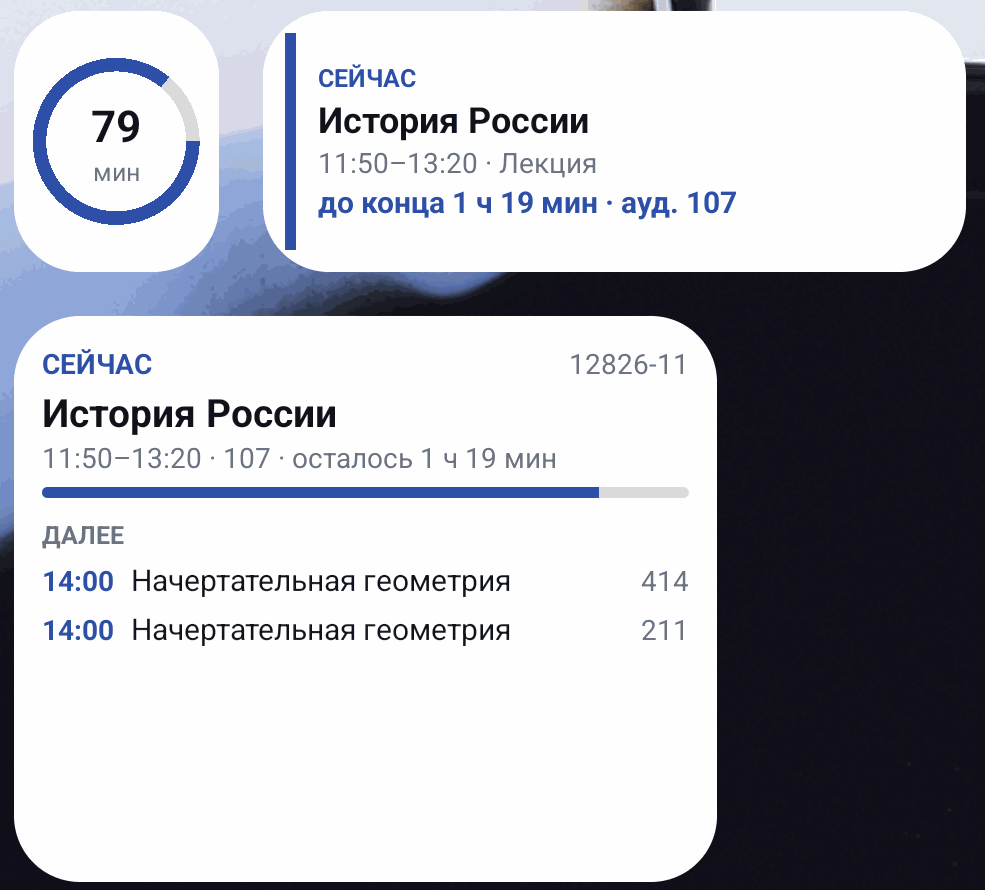

<h1 align="center">Расписание СПбГМТУ</h1>

<p align="center">
  Неофициальное приложение расписания <a href="https://www.smtu.ru/">Санкт-Петербургского
  государственного морского технического университета</a>.<br>
  Виджеты, планы корпусов, работа без интернета — 89 КБ и ничего о вас не собирает.
</p>

<p align="center">
  <a href="https://cryptoteep.github.io/smtu-schedule-android/">
    </a>
</p>

<p align="center">
  <a href="https://cryptoteep.github.io/smtu-schedule-android/">Страница установки</a> ·
  <a href="https://cryptoteep.github.io/smtu-schedule-android/app/">веб-версия</a> (iPhone и без установки)
</p>

<p align="center">
  <a href="https://github.com/Cryptoteep/smtu-schedule-android/actions/workflows/android.yml">
    </a>
  
  
  
  
  <a href="LICENSE"></a>
</p>

<p align="center">
  
</p>

## Скачать и поставить

1. Откройте [страницу установки](https://cryptoteep.github.io/smtu-schedule-android/)
   и скачайте APK прямо на телефон (там же — почему Android показывает предупреждения
   и чем проверить файл).
2. Откройте скачанный файл. Android спросит разрешение ставить приложения из
   этого источника — разрешите (обычный вопрос для APK не из Play Store).
3. Запустите, выберите свою группу из списка — дальше она запомнится.

Нужен Android 5.0 или новее. Приложение просит одно разрешение — интернет:
без него не с чего загружать расписание.

## Что умеет

<p align="center">
  
  
  
</p>

- **Группа выбирается один раз** — поиск по всем группам университета (их больше 400), дальше запоминается.
- **Неделя и день.** Свайп влево-вправо листает день или неделю, кнопка
  «Сегодня» возвращает к текущему дню. Весь семестр скачивается одним запросом,
  поэтому листание мгновенное и работает офлайн.
- **Счётчик до пары** в шапке: сколько осталось до конца текущей или сколько
  ждать ближайшую. Текущая пара подсвечена, прошедшие сегодня — приглушены.
- **Расписание преподавателя** открывается прямо в приложении — со всеми его
  группами; оттуда можно перейти к расписанию любой из них.
- **Поиск** по предмету, преподавателю, аудитории, типу занятия и группе;
  найденная пара открывается в ближайший день, когда она действительно идёт.
- **Пара добавляется в календарь** телефона, день или неделя отправляется
  текстом в мессенджер.
- **Тёмная тема** включается вместе с системной.
- **Офлайн.** Последняя загрузка лежит на телефоне: приложение стартует мгновенно
  и показывает расписание без сети. Ответ сайта заменяет сохранённую копию
  целиком, поэтому отменённая пара исчезает вместе со страницей, а не живёт в
  кэше вечно.
- **Три виджета на домашний экран:** кольцо обратного отсчёта 1×1, текущая пара
  2×1 с аудиторией и расписание на день 3×2. Обновляются сами и открывают
  приложение по тапу; ставятся из меню «⋮ → Виджет на домашний экран».
  Отсчёт идёт с точностью до минуты, но не мгновенно — см. [ниже](#виджеты-обновляются-с-точностью-до-минуты-и-это-намеренно).
- **Планы корпусов.** У занятия в корпусе А, Б или У — официальный поэтажный
  план: скачивается один раз, дальше открывается офлайн, этажи листаются
  стрелками, масштаб щипком.
- **Работает под VPN.** Сайт вуза не пускает часть зарубежных адресов — тогда
  приложение берёт расписание из резервного среза на GitHub и говорит об этом.
  Срез старше уже сохранённого расписания его не заменяет, а неудачное
  обновление остаётся видно в строке состояния, пока не пройдёт следующее.
  Оба источника запрашиваются одновременно, так что расписание появляется за
  секунды, а не после минуты ожидания.
- **Говорит о новой версии** — раз в сутки и не больше трёх раз; ставить или нет,
  решает человек.

<p align="center">
  
  
</p>

<p align="center">
  
</p>

## Приватность

Приложение ходит на `www.smtu.ru` — за расписанием, при запуске и по кнопке ⟳ —
и на страницы этого же проекта на GitHub: за резервной копией расписания, когда
сайт вуза недоступен, и за номером последней версии. Планы корпусов скачиваются
с `isu.smtu.ru`, когда их открывают. Ни аналитики, ни рекламы, ни своих серверов, ни аккаунтов. Выбранная
группа и кэш лежат в приватной папке приложения на телефоне. Код открыт
целиком; каждая правка собирается и проверяется в GitHub Actions, а APK для
установки подписывается ключом автора.

## Как это устроено

У сайта СПбГМТУ нет API, поэтому приложение разбирает его обычные страницы —
тот самый источник, который правит сам университет:

```
GET /ru/listschedule/                   -> все группы (больше 400): id и названия
GET /ru/viewschedule_new/<gid>/         -> расписание группы на весь семестр
GET /ru/viewschedule_new/teacher/<pid>/ -> расписание преподавателя на семестр
```

Дальше — два решения, из-за которых приложение показывает больше, чем сайт на
телефоне.

### Читаем таблицу, а не карточки

Каждая страница расписания рендерит одни и те же данные дважды: карточками
(`#card-container`) и таблицей (`#table-container`). Карточки выглядят
дружелюбнее, но **в них не указана группа** — а без неё расписание
преподавателя превращается в список пар неизвестно для кого. Парсер читает
таблицу:

```html
<tr class="js-week-container" id="week-up-container">   <!-- up / down / both -->
  <th>11:50-13:20</th>
  <td><i data-bs-title="Верхняя неделя"></i></td>
  <td>У 167</td>
  <td>12226-11</td>
  <td><span>Предмет</span><br><small class="text-muted">Лекция</small></td>
  <td><a href='/ru/viewperson/105760/'>Фамилия Имя Отчество</a></td>
```

Колонки ищутся по заголовкам таблицы, а не по номерам, — добавленный или
переставленный столбец не сдвинет данные молча. Карточный разбор остался
запасным путём на случай, если таблица со страницы исчезнет.

### Что случилось 15 сентября 2026

Университет переделал вёрстку расписания, и это стоило пяти дней тишины.
Страница отвечала «200 ОК», парсер находил ноль занятий, сборщик данных
публиковал пустые срезы — а приложение показывало сохранённое расписание
недельной давности, ничем не выдавая беды. Выводы вшиты в код:

- **Пустой результат — это ошибка.** Сборщик падает, если занятий не нашлось
  вовсе или если больше половины групп оказались пустыми, и такой срез не
  публикуется.
- **Разбор прежней вёрстки сохранён** рядом с новым: сохранённые страницы в
  тестах продолжают проверяться, а откат на сайте ничего не сломает.

Из данных при этом исчезло главное — **список точных дат** каждой пары. Раньше
приложение не гадало, выпадает ли пара на эту неделю, а знало это от
университета. Теперь день собирается по правилу «день недели + чётность»,
а у занятий появился третий вид недели — «каждую неделю».

### Чётность недели берётся у сайта, а не считается от даты в коде

Обычное решение — зашить в код опорную дату («неделя такого-то числа —
верхняя») и считать от неё; оно ломается после первого же переноса занятий и
устаревает к следующему семестру.

Раньше цикл восстанавливался из самого расписания: у каждой строки был список
дат, и данные сами говорили, какие календарные недели верхние. Дат больше нет,
зато сайт печатает чётность прямым текстом:

```
Сегодня: 20 Сентября 2026 года, Воскресенье, верхняя неделя
```

Эту строку приложение и разбирает — надёжнее некуда, её пишет сам университет.
Якорь кладётся в кэш и в срез на GitHub, поэтому чётность верна и офлайн.
Вывод из дат остался для сохранённых данных старого формата; если цикл в них
где-то рвётся, приложение пишет «чётность недель неточная». А если строки со
«Сегодня» на странице не оказалось вовсе и цикл пришлось считать от встроенной
даты, в строке состояния так и написано: «чётность недели не подтверждена
сайтом». Молча показывать возможно неверную неделю — худшее из решений.

### Расписание не продолжается в бесконечность

Правило «день недели + чётность» можно разворачивать хоть на год вперёд, и
приложение бодро показывало бы пары в июле, а виджет в каникулы обещал бы
«ЗАВТРА». Поэтому расписание без точных дат считается действующим от начала
недели, в которую его загрузили, и на 16 недель вперёд — примерно семестр,
вместе с сессией. Дальше экран честно говорит, чем располагает:

```
Сюда расписание не достаёт.
Оно загружено 20 сентября и покрывает по 3 января 2027.
Нажмите ⟳, чтобы взять свежее.
```

У старых данных с точными датами границы настоящие — из самих дат.

### Виджеты обновляются с точностью до минуты, и это намеренно

Виджет живёт без процесса приложения, поэтому его будит AlarmManager — раз в
минуту, пока идёт пара или до неё меньше полутора часов, иначе на момент, когда
картинка действительно изменится. Поэтому издалека виджеты пишут время начала
(«в 13:30»), а не «через 3 ч 10 мин»: такая надпись не может устареть между
пробуждениями. Будильник неточный (`setAndAllowWhileIdle`): точные
требуют разрешения уровня будильника, а расписание — не будильник.

Что это значит на практике (замерено на эмуляторе Android 16 через
`dumpsys alarm`): приложение просит разбудить его ровно через 60 секунд, а
система обещает доставку в окне `+45s` — то есть показанная минута может
отставать секунд на сорок, но никогда не убегает вперёд. В спящем режиме
(`deviceidle force-idle`) такой будильник по-прежнему проходит, но Android
ограничивает частоту подобных срабатываний, так что после долгого сна экрана
виджет может быть на несколько минут несвежим, пока телефон не разбудят.
Приложение при каждом открытии перерисовывает виджеты само.

## Структура кода

```
app/src/main/java/com/korabel/schedule/
  Dates.java            даты в epoch-днях + русские названия (без сюрпризов Locale и TimeZone)
  Html.java             снятие тегов и декодирование HTML-сущностей
  Lesson.java           занятие: время, чётность, точные даты, преподаватель, группа
  Group.java            группа с натуральной сортировкой (9 раньше 12)
  ScheduleParser.java   парсер страниц smtu.ru (обе вёрстки: до и после 15.09.2026)
  WeekParity.java       чётность недель: якорь со страницы, вывод из дат — запасной
  Schedule.java         запросы: день, неделя, «что сейчас», поиск, горизонт данных
  Mirror.java           разбор резервного среза на GitHub Pages
  Smtu.java             сеть и кэш: гонка «сайт против копии», единый вход в Android
  Now.java              «что сейчас»: идёт пара, перемена, следующий учебный день
  Version.java          сравнение номеров версий
  Updates.java          проверка обновлений по latest.json
  Maps.java             поэтажные планы корпусов (PdfRenderer, зум щипком)
  Widgets.java          перерисовка виджетов и самозаводящийся будильник
  TimerWidget/NowWidget/AgendaWidget.java   три виджета
  WidgetTick/SystemEvents.java              будильник и BOOT/TIME_SET
  Ui.java               палитра (светлая/тёмная) и построители вью
  MainActivity.java     весь экран и диалоги
app/src/test/java/…                92 JVM-теста
app/src/test/resources/fixtures/   реальные страницы smtu.ru, на которых они гоняются

docs/                 страница установки и политика конфиденциальности (GitHub Pages)
docs/latest.json      номер последней версии — по нему приложение узнаёт об обновлении
docs/app/             веб-версия: parser.js — общий парсер, app.js — приложение
docs/data/            расписания в JSON, их обновляет workflow `data`
tools/build-data.mjs  сборщик этих данных (запускается в GitHub Actions)
tools/parser.mjs      parser.js для Node — общий для сборщика и тестов
tools/snapshot-check.mjs  сторож: публиковать ли собранный срез
tools/*.test.mjs      тесты сторожа и parser.js (17, без сети)
```

Ядро не зависит от Android — поэтому парсер, даты и вся логика запросов покрыты
обычными JUnit-тестами, которые проходят за секунду.

## Тесты

```bash
./gradlew test
```

92 JVM-теста гоняются **на настоящих страницах** сайта (осенний семестр
2026/2027), сохранённых в `app/src/test/resources/fixtures/`. Проверяется, среди
прочего:

- все группы из списка разбираются и сортируются натурально (449 в сохранённой
  странице сентября, 412 в нынешней);
- у группы 12826-11 читаются все 47 строк старой вёрстки со всеми полями
  (предмет, тип, аудитория, преподаватель и его id, группа, диапазон и 8 дат);
- на нынешней вёрстке читаются все 32 строки, включая 13 занятий «каждую
  неделю», а чётность берётся из строки «Сегодня: … верхняя неделя»;
- преподаватель, напечатанный без ссылки на карточку персоны, всё равно
  распознаётся, а примечание «С 26.10 по 14.12» не принимается за ФИО;
- на странице преподавателя у каждой пары есть группа;
- карточный запасной разбор даёт тот же результат, что и таблица;
- переставленные колонки не ломают разбор, обрезанная страница не роняет парсер;
- цикл чётности восстанавливается из данных и переживает одну ошибочную строку;
- арифметика дат совпадает с `GregorianCalendar` на 11 лет вперёд;
- состояние «что сейчас» отвечает правильно на идущей паре, на перемене, до
  первой пары и после последней — на этом же расчёте живут все три виджета;
- «2.10» считается новее «2.9», а строка вроде «2.5-beta» не принимается за версию;
- расписание без дат не продолжается за горизонт: в июле занятий нет, виджет молчит;
- карточный разбор новой вёрстки даёт ровно то же, что табличный, включая
  13 занятий «каждую неделю»;
- тип занятия, напечатанный сайтом первым («Лекция» при пустом предмете), не
  становится названием пары;
- найденная поиском пара открывается в свой день с учётом чётности;
- виджет просыпается к началу отсчёта, а не к началу пары, и не позже полуночи.

Общий парсер веб-версии и сборщика (`docs/app/parser.js`) проверяется
отдельно, на тех же страницах и с теми же числами, — чтобы два парсера не
разошлись незаметно:

```bash
npm install --no-save linkedom   # один раз; в APK не попадает
node --test tools/*.test.mjs
```

### Чего эти тесты не ловят

Тут раньше стояла фраза «если университет поменяет вёрстку, тесты упадут раньше,
чем это заметит пользователь». Она была неправдой, и 15.09.2026 это доказал:
вёрстку переделали, все 68 тестов остались зелёными, а расписание на экране
замерло на неделю.

Причина простая: тесты гоняются на **сохранённых** страницах, а сохранённая
копия не меняется вместе с сайтом. Они ловят поломку парсера — и делают это
честно: сломайте в `ScheduleParser` одну букву в шаблоне строки, и четыре теста
покраснеют. Но заметить, что живая страница стала другой, они не могут в
принципе.

Это умеет только обход настоящего сайта — workflow `data`, четыре раза в сутки.
Его сторож живёт в `tools/snapshot-check.mjs` и не даёт опубликовать срез, если

- не нашлось ни одного занятия на всём сайте,
- пусто больше чем у половины групп,
- на странице нет строки «Сегодня: … неделя»,
- у большинства занятий пропало время, аудитория или преподаватель
  (переименованный столбец ломает вёрстку так же тихо, как пропавшая таблица),
- или больше пятой части групп не ответили.

Сам сторож покрыт тестами без сети (см. выше, `tools/*.test.mjs`).

А когда он срабатывает, workflow падает и **заводит issue** в этом репозитории —
чтобы поломка не отлёживалась в логах, пока кто-нибудь случайно не заметит
вчерашнюю дату в приложении.

## Сборка

Нужны JDK 17 и Android SDK (`platforms;android-36`, `build-tools;36.1.0`);
Gradle-обёртка лежит в репозитории.

```bash
./gradlew test              # юнит-тесты
./gradlew lintDebug         # статический анализ (остались только мелкие шрифты виджетов)
./gradlew assembleDebug     # app/build/outputs/apk/debug/app-debug.apk
./gradlew assembleRelease   # app/build/outputs/apk/release/app-release.apk
```

Release проходит R8 и сжатие ресурсов. Для подписи своим ключом положите в
корень `keystore.properties`:

```properties
storeFile=.keys/release.jks
storePassword=...
keyAlias=...
keyPassword=...
```

Он подхватится автоматически (схемы подписи v1+v2+v3). Без него release
подписывается отладочным ключом — годится для себя, но не для раздачи.

Каждый push собирается в GitHub Actions: тесты, lint и APK в артефактах.

## Вопросы

**А для iPhone?** Есть [веб-версия](https://cryptoteep.github.io/smtu-schedule-android/app/):
то же расписание в браузере, добавляется на экран «Домой» и работает офлайн. Она
читает данные, которые четыре раза в сутки собирает со smtu.ru сборка на GitHub
(`tools/build-data.mjs` + workflow `data`), — у сайта университета нет CORS-заголовков,
и так браузеру не нужен никакой посредник. Добавить её на экран «Домой» стоит
всерьёз: Safari стирает данные сайта, который не открывали неделю, а у значка на
экране «Домой» хранилище своё — поэтому веб-версия на iPhone сама об этом
напоминает (один раз, пока подсказку не закроют). Нативное
приложение под iOS выпустить бесплатно нельзя — Apple берёт 99 $ в год за возможность
раздавать сборку, а бесплатная подпись живёт 7 дней и требует компьютера.

**Почему не в Google Play?** Приложение неофициальное и заточено под один
университет; проще раздавать APK. Установка из файла — единственный шаг, где
Android спросит подтверждение.

**Расписание не загружается под VPN.** Сервер университета отклоняет часть
зарубежных адресов. Приложение это переживает: если сайт не ответил, оно берёт
тот же семестр из резервного среза на GitHub Pages (его собирает workflow
`data`) и помечает в строке состояния, что данные из резервной копии. Когда
сайт снова доступен, обновление опять идёт напрямую с smtu.ru.

**Расписание изменилось, а в приложении старое.** Кнопка ⟳ в шапке. Если
университет переписал страницу целиком — меню ⋮ → «Очистить кэш и загрузить
заново».

**Это безопасно?** Код открыт целиком, разрешение одно (интернет), каждая
правка собирается и проверяется в CI. APK подписан ключом автора — Android проверит подпись
при обновлении.

## Лицензия

MIT — см. [LICENSE](LICENSE). Приложение не связано с СПбГМТУ; все данные
расписания принадлежат университету.

Основано на [первой версии](https://gitlab.com/trigger337/smtu-schedule-android-app)
и продолжает переглядываться с ней: виджеты, поэтажные планы корпусов и проверка
обновлений — идеи оттуда, переписанные под здешнюю модель данных. Спасибо
[trigger337](https://gitlab.com/trigger337).

История изменений — в [CHANGELOG.md](CHANGELOG.md).

---

## English

Unofficial schedule viewer for [SPbSMTU](https://www.smtu.ru/) (Saint Petersburg
State Marine Technical University). Pure Java, zero third-party libraries (no
AndroidX), all views built in code; the signed release APK is 89 KB.

**Features.** Pick your group once from all 400+; week and day views with swipe
navigation; the lesson happening now is highlighted; a teacher's full schedule
opens in place, across all their groups; search over subject, teacher, room,
type and group; add a lesson to the phone's calendar or share a day as text;
three home-screen widgets (a 1x1 countdown ring, a 2x1 current-lesson card, a
3x2 day agenda); official floor plans for buildings A, B and U; dark theme;
fully offline after the first fetch. When the university's server refuses the
phone's exit IP (common on a VPN), the app falls back to a snapshot published on
this project's own GitHub Pages and says so.

**How it works.** The site has no API, so the app parses its server-rendered
pages. It reads the **table** view rather than the cards: the table is the only
one that names the group of each lesson. Columns are located by their header
text, so a reordered column cannot shift data silently.

**The university changed the markup on 15 September 2026** — and it cost five
silent days: pages still answered 200, the parser found no lessons at all, and
the collector happily published empty snapshots. Both are now hard errors, the
previous markup is still parsed, and the tests cover the old and new pages
side by side.

**Week parity comes from the site itself**: the page prints «Сегодня: … верхняя
неделя», and that anchor is stored in the cache and in the snapshot, so parity
stays right offline. Exact per-lesson dates are gone from the page, so a day is
matched by weekday plus parity — and a lesson may now run on both weeks.

**Tests.** `./gradlew test` runs 92 JVM tests against real pages saved from
smtu.ru; `node --test tools/*.test.mjs` checks the shared web/collector parser
on the same pages and the snapshot guard. The core (`Dates`, `Html`, `Lesson`, `Group`, `ScheduleParser`,
`WeekParity`, `Schedule`) has no Android dependencies; `Smtu` is the only class
that knows about `Context`.

**Build.** JDK 17 + Android SDK 36 (build-tools 36.1.0), wrapper included: `./gradlew assembleRelease`.
Drop a `keystore.properties` in the project root to sign with your own key.

Min SDK 21, target SDK 36, internet permission only. MIT licensed; not
affiliated with SPbSMTU.
