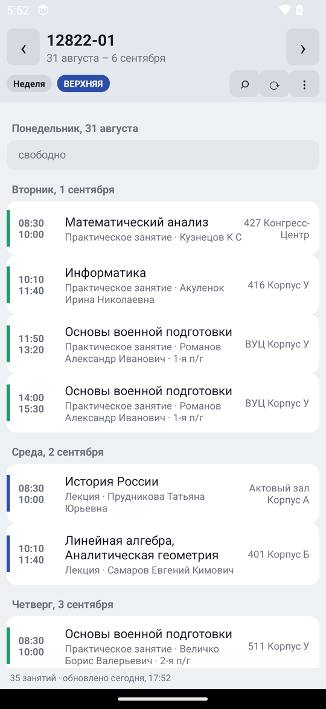
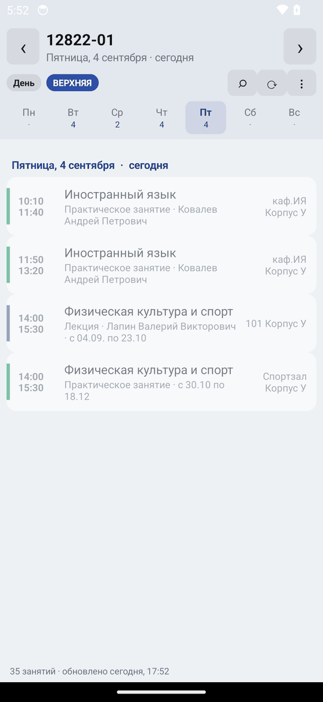
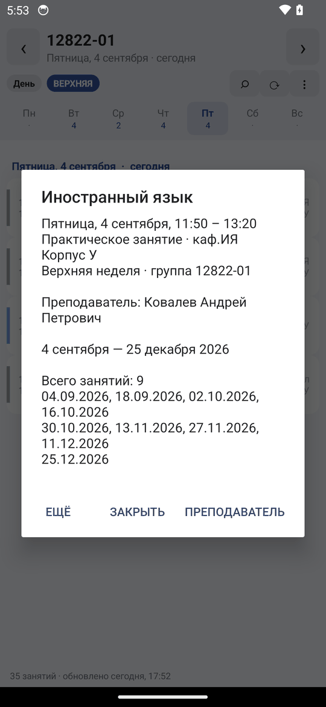

# Расписание СПбГМТУ

Неофициальное Android-приложение для просмотра расписания
[СПбГМТУ](https://www.smtu.ru/). Чистая Java, ни одной сторонней библиотеки
(без AndroidX), весь интерфейс собирается кодом. Release-APK — 48 КБ.

[English below](#english)

<p align="center">
  
  
  
</p>

## Возможности

- **Выбор группы один раз** — поиск по всем 449 группам, дальше запоминается.
- **Неделя и день** — переключение одной кнопкой, свайп влево/вправо листает
  день или неделю. Весь семестр загружается одним запросом, дальше листание
  мгновенное и работает офлайн.
- **Верхняя/нижняя неделя** вычисляется **из самих данных сайта**: у каждого
  занятия есть список точных дат, по ним и восстанавливается цикл чётности —
  никакой захардкоженной «опорной недели», которая протухает к следующему
  семестру.
- **Текущая пара подсвечивается**, прошедшие сегодня — приглушены.
- **Расписание преподавателя** открывается прямо в приложении (тап по занятию →
  «Преподаватель»), со всеми его группами; кнопка «назад» возвращает к своей.
- **Поиск** по предмету, преподавателю, аудитории, типу занятия и группе.
- **Добавить пару в календарь** телефона и **поделиться** днём/неделей текстом.
- **Тёмная тема** — автоматически по системной.
- **Офлайн**: каждая загрузка сливается в кэш, приложение стартует мгновенно и
  показывает расписание без сети; занятия, удалённые с сайта, остаются в истории.

## Источник данных: только www.smtu.ru

У сайта нет API, поэтому приложение разбирает его серверные страницы —
единственный авторитетный источник, который правит сам университет:

```
GET /ru/listschedule/                   -> 449 групп: id и названия
GET /ru/viewschedule_new/<gid>/         -> расписание группы на весь семестр
GET /ru/viewschedule_new/teacher/<pid>/ -> расписание преподавателя на семестр
                                           (pid — id из ссылки /ru/viewperson/<pid>/)
```

Каждая страница отдаёт весь семестр одним ответом и рендерит его дважды:
карточками (`#card-container`) и таблицей (`#table-container`). Парсер читает
**таблицу** — она регулярнее и богаче: только там у занятия указана **группа**,
без которой расписание преподавателя бесполезно. Карточный вид оставлен
запасным путём на случай, если таблица исчезнет.

```html
<tr class="js-week-container js-week-1">          <!-- 1 — верхняя, 2 — нижняя -->
  <th>08:30 - 10:00</th>
  <td>верхняя</td>
  <td title="14.09.2026, 28.09.2026, …">14 сентября — 21 декабря 2026</td>
  <td>167 Корпус У</td>
  <td>12826-11</td>
  <td><span>Предмет</span><br><small class="text-muted">Лекция</small></td>
  <td><a href='/ru/viewperson/105760/'>Фамилия Имя Отчество</a></td>
```

Колонки ищутся по заголовкам таблицы, а не по номерам, поэтому добавленный или
переставленный столбец не сдвигает данные молча. Атрибут `title` со всеми
точными датами — то, что делает просмотр по дням и неделям точным.

Сайт нигде не пишет чётность текущей недели машиночитаемо, но это и не нужно:
даты занятий из `js-week-1`/`js-week-2` сами задают цикл. `WeekParity` берёт
неделю с самым уверенным большинством за опорную и проверяет по ней весь
семестр; если цикл где-то рвётся, приложение честно пишет «чётность недель
неточная» в строке состояния.

## Структура

```
app/src/main/java/com/korabel/schedule/
  Dates.java            даты в epoch-днях + русские названия (без Locale и TimeZone-сюрпризов)
  Html.java             снятие тегов и декодирование HTML-сущностей
  Lesson.java           занятие: время, чётность, точные даты, преподаватель, группа
  Group.java            группа с натуральной сортировкой (9 раньше 12)
  ScheduleParser.java   парсер страниц smtu.ru (таблица + карточки-фолбэк)
  WeekParity.java       восстановление цикла верхняя/нижняя по данным
  Schedule.java         запросы к расписанию: день, неделя, «сейчас», поиск, слияние с кэшем
  Smtu.java             сеть и кэш (единственный класс, знающий про Android Context)
  Ui.java               палитра (светлая/тёмная) и построители вью
  MainActivity.java     весь экран и диалоги
app/src/test/java/…     50 JVM-тестов
app/src/test/resources/fixtures/   реальные страницы smtu.ru, на которых гоняются тесты
```

Ядро (`Dates`, `Html`, `Lesson`, `Group`, `ScheduleParser`, `WeekParity`,
`Schedule`) не зависит от Android — поэтому парсер и вся логика дат покрыты
обычными JUnit-тестами, которые идут за секунду.

## Тесты

```bash
./gradlew test
```

50 тестов гоняются **на настоящих страницах** сайта (осенний семестр 2026/2027),
сохранённых в `app/src/test/resources/fixtures/`. Они проверяют, среди прочего:

- все 449 групп разбираются и сортируются натурально;
- у группы 12826-11 читаются все 47 строк со всеми полями (предмет, тип,
  аудитория, преподаватель + его id, группа, диапазон и 8 точных дат);
- преподаватель, напечатанный без ссылки на карточку персоны, всё равно
  распознаётся, а примечание «С 26.10 по 14.12» не принимается за ФИО;
- на странице преподавателя у каждого занятия есть группа;
- карточный фолбэк даёт тот же результат, что и таблица;
- переставленные колонки не ломают разбор, обрезанная страница не роняет парсер;
- цикл чётности недель восстанавливается из данных и устойчив к одной
  ошибочной строке;
- арифметика дат совпадает с `GregorianCalendar` на 11 лет вперёд.

Если университет поменяет вёрстку, тесты упадут раньше пользователя.

## Сборка

Нужны JDK 17 и Android SDK (`platforms;android-34`, `build-tools;34.0.0`).
Gradle-обёртка в репозитории.

```bash
./gradlew assembleDebug     # app/build/outputs/apk/debug/app-debug.apk
./gradlew assembleRelease   # app/build/outputs/apk/release/app-release.apk
./gradlew test              # юнит-тесты
adb install -r app/build/outputs/apk/debug/app-debug.apk
```

Release собирается с R8 и сжатием ресурсов. Для подписи положите рядом
`keystore.properties` (ключи перечислены в `app/build.gradle`) — он подхватится
автоматически; без него release подписывается отладочным ключом: годится для
личной установки, но не для публикации.

Готовый APK собирается и в CI: вкладка **Actions** → последний прогон →
артефакт `app-debug.apk`.

## Замечания

- Приложение ходит на `www.smtu.ru` напрямую. Сервер университета отклоняет
  часть зарубежных IP, поэтому под VPN с иностранным выходом первая загрузка
  может не пройти — дальше приложение работает из кэша.
- Сеть используется только при запуске и по кнопке ⟳.
- Min SDK 21 (Android 5.0), target SDK 34. Разрешения: только интернет.

## Лицензия

MIT — см. [LICENSE](LICENSE). Приложение не связано с СПбГМТУ; все данные
расписания принадлежат университету.

---

<a name="english"></a>

# SPbSMTU Schedule

Unofficial Android schedule viewer for [SPbSMTU](https://www.smtu.ru/) (Saint
Petersburg State Marine Technical University). Pure Java, zero third-party
libraries (no AndroidX), all views built in code. The release APK is 48 KB.

## Features

- **Pick your group once** — searchable list of all 449 groups, remembered after.
- **Week and day views**, swipe left/right to move a day or a week. One fetch
  holds the whole semester, so navigation is instant and works offline.
- **Upper/lower week parity is derived from the site's own data**: every lesson
  carries the exact dates it happens on, so the cycle is reconstructed instead
  of hard-coded — it cannot go stale next semester.
- **The lesson happening now is highlighted**; today's finished ones are dimmed.
- **A teacher's full schedule** opens in place (tap a lesson → «Преподаватель»),
  across all their groups, with back returning to yours.
- **Search** across subject, teacher, room, lesson type and group.
- **Add a lesson to the phone's calendar**, or share a day/week as text.
- **Dark theme**, following the system.
- **Offline**: every fetch merges into a cache, so the app starts instantly and
  keeps lessons the university later removes from the page.

## Data source: www.smtu.ru only

The site has no API, so the app parses its server-rendered pages:

```
GET /ru/listschedule/                   -> all 449 group ids and names
GET /ru/viewschedule_new/<gid>/         -> a group's full-semester schedule
GET /ru/viewschedule_new/teacher/<pid>/ -> a teacher's full-semester schedule
```

Each page renders the same data twice — as cards and as a table. The parser
reads the **table**: it is more regular and strictly richer, and it is the only
view that names the **group** of each lesson, without which a teacher's
timetable is useless. Columns are located by their header text, so a reordered
column does not shift the data silently. The `title` attribute listing every
occurrence date is what makes the day and week views exact.

Week parity is derived from those dates (`WeekParity`): the week with the
strongest majority becomes the anchor, and the rest of the semester is checked
against it — a broken cycle is reported in the status line rather than hidden.

## Layout, tests, building

See the Russian sections above; the commands are:

```bash
./gradlew test              # 50 JVM tests against real saved pages
./gradlew assembleDebug
./gradlew assembleRelease
```

The core (`Dates`, `Html`, `Lesson`, `Group`, `ScheduleParser`, `WeekParity`,
`Schedule`) has no Android dependencies, which is what makes it testable on the
JVM in under a second. `Smtu` is the only class that knows about `Context`.

Min SDK 21, target SDK 34, internet permission only.

## License

MIT — see [LICENSE](LICENSE). Not affiliated with SPbSMTU; all schedule data
belongs to the university.
