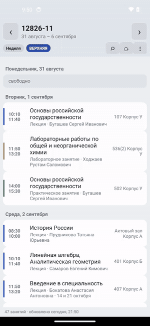
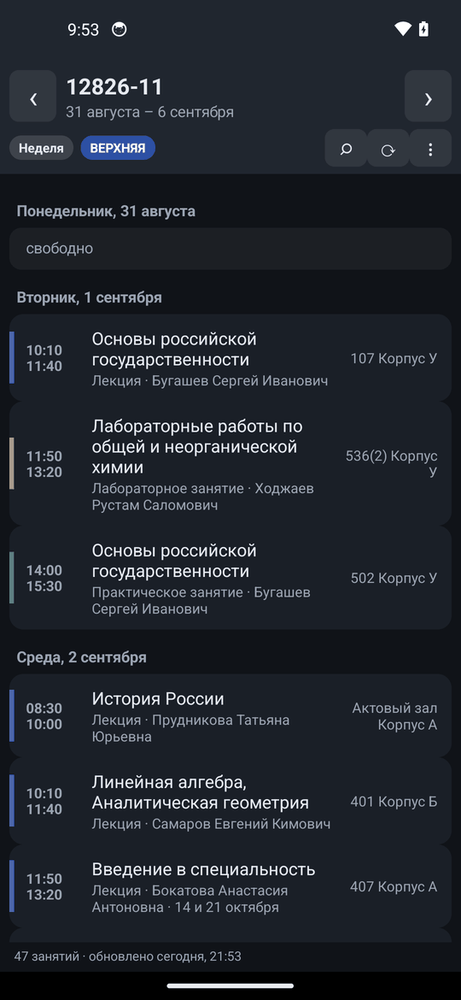
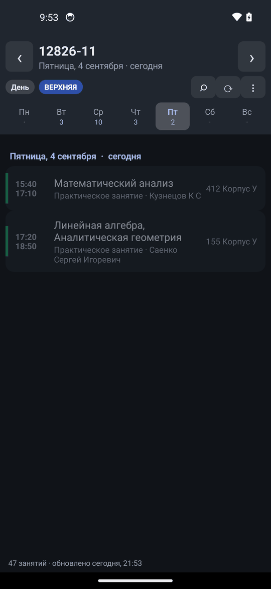

<h1 align="center">Расписание СПбГМТУ</h1>

<p align="center">
  Неофициальное приложение расписания <a href="https://www.smtu.ru/">Санкт-Петербургского
  государственного морского технического университета</a>.<br>
  Открывается мгновенно, работает без интернета, весит 53 КБ и ничего о вас не собирает.
</p>

<p align="center">
  <a href="https://github.com/Cryptoteep/smtu-schedule-android/releases/latest">
    </a>
</p>

<p align="center">
  <a href="https://github.com/Cryptoteep/smtu-schedule-android/actions/workflows/android.yml">
    </a>
  
  
  
  
  <a href="LICENSE"></a>
</p>

<p align="center">
  
</p>

## Скачать и поставить

1. Откройте [страницу релиза](https://github.com/Cryptoteep/smtu-schedule-android/releases/latest)
   и скачайте `smtu-schedule-*.apk` прямо на телефон.
2. Откройте скачанный файл. Android спросит разрешение ставить приложения из
   этого источника — разрешите (обычный вопрос для APK не из Play Store).
3. Запустите, выберите свою группу из списка — дальше она запомнится.

Нужен Android 5.0 или новее. Приложение просит одно разрешение — интернет:
без него не с чего загружать расписание.

## Что умеет

<p align="center">
  
  
  
</p>

- **Группа выбирается один раз** — поиск по всем 449 группам, дальше запоминается.
- **Неделя и день.** Свайп влево-вправо листает день или неделю, кнопка
  «Сегодня» возвращает к текущему дню. Весь семестр скачивается одним запросом,
  поэтому листание мгновенное и работает офлайн.
- **Видно, что идёт прямо сейчас**: текущая пара подсвечена, уже прошедшие
  сегодня — приглушены.
- **Расписание преподавателя** открывается прямо в приложении — со всеми его
  группами; оттуда можно перейти к расписанию любой из них.
- **Поиск** по предмету, преподавателю, аудитории, типу занятия и группе.
- **Пара добавляется в календарь** телефона, день или неделя отправляется
  текстом в мессенджер.
- **Тёмная тема** включается вместе с системной.
- **Офлайн.** Каждая загрузка сливается с кэшем: приложение стартует мгновенно
  и показывает расписание без сети, а пары, которые университет позже убрал со
  страницы, остаются в истории.

<p align="center">
  
  
</p>

## Приватность

Приложение ходит **только** на `www.smtu.ru` — за расписанием, при запуске и по
кнопке ⟳. Ни аналитики, ни рекламы, ни своих серверов, ни аккаунтов. Выбранная
группа и кэш лежат в приватной папке приложения на телефоне. Код открыт
целиком, APK собирается из него же в GitHub Actions.

## Как это устроено

У сайта СПбГМТУ нет API, поэтому приложение разбирает его обычные страницы —
тот самый источник, который правит сам университет:

```
GET /ru/listschedule/                   -> 449 групп: id и названия
GET /ru/viewschedule_new/<gid>/         -> расписание группы на весь семестр
GET /ru/viewschedule_new/teacher/<pid>/ -> расписание преподавателя на семестр
```

Дальше — два решения, из-за которых приложение показывает больше, чем сайт на
телефоне.

### Читаем таблицу, а не карточки

Каждая страница расписания рендерит одни и те же данные дважды: карточками
(`#card-container`) и таблицей (`#table-container`). Карточки выглядят
дружелюбнее, но **в них не указана группа** — а без неё расписание
преподавателя превращается в список пар неизвестно для кого. Парсер читает
таблицу:

```html
<tr class="js-week-container js-week-1">          <!-- 1 — верхняя, 2 — нижняя -->
  <th>08:30 - 10:00</th>
  <td>верхняя</td>
  <td title="14.09.2026, 28.09.2026, …">14 сентября — 21 декабря 2026</td>
  <td>167 Корпус У</td>
  <td>12826-11</td>
  <td><span>Предмет</span><br><small class="text-muted">Лекция</small></td>
  <td><a href='/ru/viewperson/105760/'>Фамилия Имя Отчество</a></td>
```

Колонки ищутся по заголовкам таблицы, а не по номерам, — добавленный или
переставленный столбец не сдвинет данные молча. Карточный разбор остался
запасным путём на случай, если таблица со страницы исчезнет.

Атрибут `title` со **всеми точными датами** каждой пары — то, что делает
просмотр по дням честным: приложение не гадает, «выпадает ли пара на эту
неделю», а знает это от университета.

### Чётность недели считается из данных, а не от даты в коде

Сайт нигде не пишет машиночитаемо, какая неделя сейчас. Обычное решение —
зашить в код опорную дату («неделя такого-то числа — верхняя») и считать от
неё; оно ломается после первого же переноса занятий и устаревает к следующему
семестру.

Здесь цикл восстанавливается из самого расписания: каждая строка помечена
`js-week-1`/`js-week-2` и несёт список своих дат, то есть данные сами говорят,
какие календарные недели верхние. Опорной берётся неделя с самым уверенным
большинством, затем по ней проверяется весь семестр; если цикл где-то рвётся,
приложение честно пишет «чётность недель неточная» в строке состояния, а не
делает вид, что всё в порядке.

## Структура кода

```
app/src/main/java/com/korabel/schedule/
  Dates.java            даты в epoch-днях + русские названия (без сюрпризов Locale и TimeZone)
  Html.java             снятие тегов и декодирование HTML-сущностей
  Lesson.java           занятие: время, чётность, точные даты, преподаватель, группа
  Group.java            группа с натуральной сортировкой (9 раньше 12)
  ScheduleParser.java   парсер страниц smtu.ru (таблица + карточки как запасной путь)
  WeekParity.java       восстановление цикла верхняя/нижняя по данным
  Schedule.java         запросы: день, неделя, «что сейчас», поиск, слияние с кэшем
  Smtu.java             сеть и кэш — единственный класс, знающий про Android Context
  Ui.java               палитра (светлая/тёмная) и построители вью
  MainActivity.java     весь экран и диалоги
app/src/test/java/…                50 JVM-тестов
app/src/test/resources/fixtures/   реальные страницы smtu.ru, на которых они гоняются
```

Ядро не зависит от Android — поэтому парсер, даты и вся логика запросов покрыты
обычными JUnit-тестами, которые проходят за секунду.

## Тесты

```bash
./gradlew test
```

50 тестов гоняются **на настоящих страницах** сайта (осенний семестр
2026/2027), сохранённых в `app/src/test/resources/fixtures/`. Проверяется, среди
прочего:

- все 449 групп разбираются и сортируются натурально;
- у группы 12826-11 читаются все 47 строк со всеми полями (предмет, тип,
  аудитория, преподаватель и его id, группа, диапазон и 8 точных дат);
- преподаватель, напечатанный без ссылки на карточку персоны, всё равно
  распознаётся, а примечание «С 26.10 по 14.12» не принимается за ФИО;
- на странице преподавателя у каждой пары есть группа;
- карточный запасной разбор даёт тот же результат, что и таблица;
- переставленные колонки не ломают разбор, обрезанная страница не роняет парсер;
- цикл чётности восстанавливается из данных и переживает одну ошибочную строку;
- арифметика дат совпадает с `GregorianCalendar` на 11 лет вперёд.

Если университет поменяет вёрстку, тесты упадут раньше, чем это заметит
пользователь.

## Сборка

Нужны JDK 17 и Android SDK (`platforms;android-34`, `build-tools;34.0.0`);
Gradle-обёртка лежит в репозитории.

```bash
./gradlew test              # юнит-тесты
./gradlew lintDebug         # статический анализ
./gradlew assembleDebug     # app/build/outputs/apk/debug/app-debug.apk
./gradlew assembleRelease   # app/build/outputs/apk/release/app-release.apk
```

Release проходит R8 и сжатие ресурсов. Для подписи своим ключом положите в
корень `keystore.properties`:

```properties
storeFile=.keys/release.jks
storePassword=...
keyAlias=...
keyPassword=...
```

Он подхватится автоматически (схемы подписи v1+v2+v3). Без него release
подписывается отладочным ключом — годится для себя, но не для раздачи.

Каждый push собирается в GitHub Actions: тесты, lint и APK в артефактах.

## Вопросы

**Почему не в Google Play?** Приложение неофициальное и заточено под один
университет; проще раздавать APK. Установка из файла — единственный шаг, где
Android спросит подтверждение.

**Расписание не загружается.** Сервер университета отклоняет часть зарубежных
IP: под VPN с иностранным выходом первая загрузка может не пройти. Выключите
VPN и нажмите ⟳ — дальше приложение работает из кэша даже без сети.

**Расписание изменилось, а в приложении старое.** Кнопка ⟳ в шапке. Если
университет переписал страницу целиком — меню ⋮ → «Очистить кэш и загрузить
заново».

**Это безопасно?** Код открыт целиком, разрешение одно (интернет), сборка
воспроизводится в CI. APK подписан ключом автора — Android проверит подпись
при обновлении.

## Лицензия

MIT — см. [LICENSE](LICENSE). Приложение не связано с СПбГМТУ; все данные
расписания принадлежат университету.

Основано на [первой версии](https://gitlab.com/trigger337/smtu-schedule-android-app).
История изменений — в [CHANGELOG.md](CHANGELOG.md).

---

## English

Unofficial schedule viewer for [SPbSMTU](https://www.smtu.ru/) (Saint Petersburg
State Marine Technical University). Pure Java, zero third-party libraries (no
AndroidX), all views built in code; the signed release APK is 53 KB.

**Features.** Pick your group once from all 449; week and day views with swipe
navigation; the lesson happening now is highlighted; a teacher's full schedule
opens in place, across all their groups; search over subject, teacher, room,
type and group; add a lesson to the phone's calendar or share a day as text;
dark theme; fully offline after the first fetch.

**How it works.** The site has no API, so the app parses its server-rendered
pages. It reads the **table** view rather than the cards: the table is the only
one that names the group of each lesson, and its `title` attribute lists every
exact date a lesson occurs on. Columns are located by their header text, so a
reordered column cannot shift data silently.

**Week parity is derived from the data**, not hard-coded: every row is tagged
`js-week-1`/`js-week-2` and carries its dates, so the upper/lower cycle is
reconstructed from the schedule itself — and reported as uncertain when the
cycle does not add up.

**Tests.** `./gradlew test` runs 50 JVM tests against real pages saved from
smtu.ru. The core (`Dates`, `Html`, `Lesson`, `Group`, `ScheduleParser`,
`WeekParity`, `Schedule`) has no Android dependencies; `Smtu` is the only class
that knows about `Context`.

**Build.** JDK 17 + Android SDK 34, wrapper included: `./gradlew assembleRelease`.
Drop a `keystore.properties` in the project root to sign with your own key.

Min SDK 21, target SDK 34, internet permission only. MIT licensed; not
affiliated with SPbSMTU.
